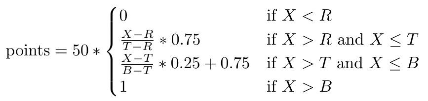

MiniProject 2: COMP 551 (001/002), Applied Machine Learning, Winter 2020, McGill University: Kaggle Reddit Classification
===========================

## Contents

1. [Preamble](#preamble)
2. [Background](#background)
3. [Tasks](#tasks)
4. [Deliverables](#deliverables)
5. [Project write-up](#project-write-up)
5. [Evaluation](#evaluation)
6. [Final remarks](#final-remarks)
7. [Rules specific to the Kaggle competition](#rules-specific-to-the-kaggle-competition)
8. [How to run the Python program](#how-to-run-the-python-program)

[Assignment description (PDF) (COMP551 P2 Fall 2019)](https://github.com/ramonfigueiredopessoa/comp551-2020-p2_kaggle_reddit_classification/blob/master/assignment/2019-fall-miniproject2_spec.pdf)

# Preamble

* This mini-project is **due on XXX XXX at 11:59pm**. Late work will be automatically subject to a 20% penalty and can be submitted up to 5 days after the deadline. No submissions will accepted after this 5 day period.
* This mini-project is to completed in groups of three. All members of a group will recieve the same grade. It is not expected that all team members will contribute equally to all components. However every team member should make integral contributions to the project.
* You will submit your assignment on MyCourses as a group, and you will also submit to a Kaggle competition. You must register in the Kaggle competition using the email that you are associated with on MyCourses (i.e., @mail.mcgill.ca for McGill students). You can register for the competition at: https://www.kaggle.com/t/cbd6c7bc66394bd682983a6daeefe759
As with MiniProject 1, you must register your group on MyCourses and any group member can submit. You must also form teams on Kaggle and you must use your MyCourses group name as your team name on Kaggle. All Kaggle submissions must be associated with a valid team registered on MyCourses.
* Except where explicitly noted in this specification, you are free to use any Python library or utility for this project.

Go back to [Contents](#contents).

# Background

In this mini-project you will develop models to analyze text from the website Reddit (https://www.reddit.com/), a popular social media forum where users post and comment on content in different themed communities, or subreddits. The goal of this project is to develop a supervised classification model that can predict what community a comment came from. You will be competing with other groups to achieve the best accuracy in a competition for this prediction task. **However, your performance on the competition is only one aspect of your grade. We also ask that you implement a minimum set of models and report on their performance in a write-up.**

The Kaggle website has a link to the data, which is a 20-class classification problem with a (nearly) balanced dataset (i.e., there are equal numbers of comments from 20 different subreddits). The data is provided in CSVs, where the text content of the comment is enclosed in quotes. Each entry in the training CSV contains a comment ID, the text of the comment, and the name of the target subreddit for that comment. For the test CSV, each line contains a comment ID and the text for that comment. You can view and download the data via this link: https://www.kaggle.com/c/reddit-comment-classification-comp-551/data

You need to submit a prediction for each comment in the test CSV; i.e., you should make a prediction CSV where each line contains a comment ID and the predicted subreddit for that comment. Since the data is balanced and involves multiple classes, you will be evaluated according to the accuracy score your the model. An example of the proper formatting for the submission file can be viewed at: https://www.kaggle.com/c/reddit-comment-classification-comp-551/overview/evaluation.

Go back to [Contents](#contents).

# Tasks

You are welcome to try any model you like on this task, and you are free to use any libraries you like to extract features. However, **you must meet the following requirements**:

* You must implement a Bernoulli Naive Bayes model (i.e., the Naive Bayes model from Lecture 5) from scratch (i.e., without using any external libraries such as SciKit learn). You are free to use any text pre-processing that you like with this model. **Hint 1:** you may want to use Laplace smoothing with
your Bernoulli Naive Bayes model. **Hint 2:** you can choose the vocabulary for your model (i.e, which words you include vs. ignore), but you should provide justification for the vocabulary you use.

* You must run experiments using at least two different classifiers from the Scikit-learn package (which are not Bernoulli Naive Bayes). Possible options are:
	- Logistic regression (https://scikit-learn.org/stable/modules/generated/sklearn.linear_model.LogisticRegression.html)
	- Decision trees (https://scikit-learn.org/stable/modules/generated/sklearn.tree.DecisionTreeClassifier.html)
	- Support vector machines [to be introduced in Lecture 10 on Oct. 7th] (https://scikit-learn.org/stable/modules/generated/sklearn.svm.LinearSVC.html)

* You must develop a model validation pipeline (e.g., using k-fold cross validation or a held-out validation set) and report on the performance of the above mentioned model variants.

* **You should evaluate all the model variants above (i.e., Naive Bayes and the SciKit learn models) using your validation pipeline (i.e., without submitting to Kaggle) and report on these comparisons in your write-up. Ideally, you should only run your “best” model on the Kaggle competition, since you are limited to two submissions to Kaggle per day.**

Go back to [Contents](#contents).

# Deliverables

You must submit two separate files to MyCourses (*using the exact filenames and file types outlined below*):

1. **code.zip:** A collection of .py, .ipynb, and other supporting code files, which must work with Python version 3. You must include your implementation of Bernoulli Naive Bayes and it must be possible for the TAs to reproduce all the results in your report and your Kaggle leaderboard submissions using your submitted code. Please submit a README detailing the packages you used and providing instructions to replicate your results.

2. **writeup.pdf:** Your (max 5-page) project write-up as a pdf (details below).

Go back to [Contents](#contents).

## Project write-up

Your team must submit a project write-up that is a maximum of five pages (single-spaced, 10pt font or larger; extra pages for references/bibliographical content and appendices can be used). We highly recommend that students use LaTeX to complete their write-ups and use the bibtex feature for citations. **You are free to structure the report how you see it fits**; below are general guidelines and recommendations, **but this is only a suggested structure and you may deviate from it as you see fit.**

**Abstract (100-250 words)** Summarize the project task and your most important findings.

**Introduction (5+ sentences)** Summarize the project task, the dataset, and your most important findings. This should be similar to the abstract but more detailed.

**Related work (4+ sentences)** Summarize previous literature related to the sentiment classification problem.

**Dataset and setup (3+ sentences)** Very briefly describe the dataset and any basic data pre-processing methods that are common to all your approaches (e.g., tokenizing). Note: You do not need to explicitly verify that the data satisfies the i.i.d. assumption (or any of the other formal assumptions for linear classification).

**Proposed approach (7+ sentences )** Briefly describe the different models you implemented/compared and the features you designed, providing citations as necessary. If you use or build upon an existing model based on previously published work, it is essential that you properly cite and acknowledge this previous work. Discuss algorithm selection and implementation. Include any decisions about training/validation split, regularization strategies, any optimization tricks, setting hyper-parameters, etc. It is not necessary to provide detailed derivations for the models you use, but you should provide at least few sentences of background (and motivation) for each model.

**Results (7+ sentences, possibly with figures or tables)** Provide results on the different models you implemented (e.g., accuracy on the validation set, runtimes). You should report your leaderboard test set accuracy in this section, but most of your results should be on your validation set (or from cross-validation).

**Discussion and Conclusion (3+ sentences)** Summarize the key takeaways from the project and possibly directions for future investigation.

**Statement of Contributions (1-3 sentences)** State the breakdown of the workload.

Go back to [Contents](#contents).

# Evaluation

The mini-project is out of 100 points, and the evaluation breakdown is as follows:

* Performance (50 points)
    - The performance of your models will be evaluated on the Kaggle competition. Your grade will be computed based on your performance on a **held-out test set**. The grade computation is a linear interpolation between the performance of a random baseline, a TA baseline, and the 3rd best group in the class. The top five groups all receive full grades on the competition portion.
    - Thus, if we let X denote your accuracy on the held-out test set, R denote the accuracy of the random baseline, B denote the accuracy of the 3rd best group, and T denote the TA baseline, your score
		
		**The equation may look complicated, but the basic idea is as follows:**
			∗ The random baseline represents the score needed to get more than 0% on the competition, the TA baseline represents the score needed to get 75% on the competition, and the 3rd best performing group represents the score needed to get 100%.
			∗ If your score is between the random baseline and the TA baseline, then your grade is a linear interpolation between 0% and 75% on the competition.
			∗ If your score is between the TA baseline and the 3rd-best group, then your grade is a linear interpolation between 75% and 100% on the competition.
		- In addition to the above, the top performing group will receive a bonus of 10 points.
* Quality of write-up and proposed methodology (50 points). As with the previous mini-projects your write-up will be judged according its scientific quality (included but not limited to):
	- Do you report on all the required experiments and comparisons?
	- Is your proposed methodology technically sound?
	- How detailed/rigorous/extensive are your experiments?
	- Does your report clearly describe the task you are working on, the experimental set-up, results, and figures (e.g., don't forget axis labels and captions on figures, don’t forget to explain figures in the text).
- Is your report well-organized and coherent?
- Is your report clear and free of grammatical errors and typos?
- Does your report include an adequate discussion of related work and citations?

# Final remarks

You are expected to display initiative, creativity, scientific rigour, critical thinking, and good communication skills. You don't need to restrict yourself to the requirements listed above - feel free to go beyond, and explore further.

You can discuss methods and technical issues with members of other teams, but you cannot share any code or data with other teams. Any team found to cheat (e.g. use external information, use resources without proper references) on either the code, predictions or written report will receive a score of 0 for all components of the project.

# Rules specific to the Kaggle competition

* Don’t cheat! You must submit code that can reproduce the numbers of your leaderboard solution.
* The classification challenge is based on a public dataset. You must not attempt to cheat by searching for information about the test set. Submissions with suspicious accuracies and/or predictions will be flagged and your group will receive a 0 if you used external information about the test set at any point.
* Do not make more than one team for your group (e.g., to make more submissions). You will receive a grade of 0 for intentionally creating new groups with the purpose of making more Kaggle submissions.


## How to run the Python program?

1. Install [virtualenv](https://virtualenv.pypa.io/en/latest/)
	* To activate the virtualenv on Linux or MacOS: ```source venv/bin/activate```
	* To activate the virtualenv on Windows: ```\venv\Script\activate.bat```

2. Run the program

```sh
cd code/

```#!/bin/sh
virtualenv venv -p python3
```

or (if you are using Mac)

```#!/bin/sh
python3 -m venv env  
```

source venv/bin/activate

pip install -r requirements.txt

python main.py
```

**Note**: To desactivate the virtual environment

```sh
deactivate
```


For more help you can type python ```main.py -h``` and get the arguments to run specific methods on specific datasets.

```
usage: main.py [-h]

MiniProject 2: Kaggle Reddit Classification. Authors: Ramon Figueiredo
Pessoa, Rafael Gomes Braga, Ege Odaci

optional arguments:
  -h, --help            show this help message and exit
  -c CLASSIFIER, --classifier CLASSIFIER
                        Classifier used (Options: all,
                        logistic_regression_sklearn OR lrskl,
                        logistic_regression OR lr, naive_bayes_sklearn OR
                        nbskl naive_bayes OR nb).
  -tsize TRAINING_SET_SIZE, --train_size TRAINING_SET_SIZE
                        Training set size (percentage). Should be between 0.0
                        and 1.0 and represent the proportion of the dataset to
                        include in the training split
  -d DATASET, --dataset DATASET
                        Database used (Options: all, ionosphere OR i adult OR
                        a wine_quality OR wqbreast_cancer_diagnosis OR bcd).
  -save_logs, --save_logs_in_file
                        Save logs in a file
  -v, --version         show program's version number and exit

COMP 551 (001/002), Applied Machine Learning, Winter 2020, McGill University.
```


Go to [Contents](#contents)
